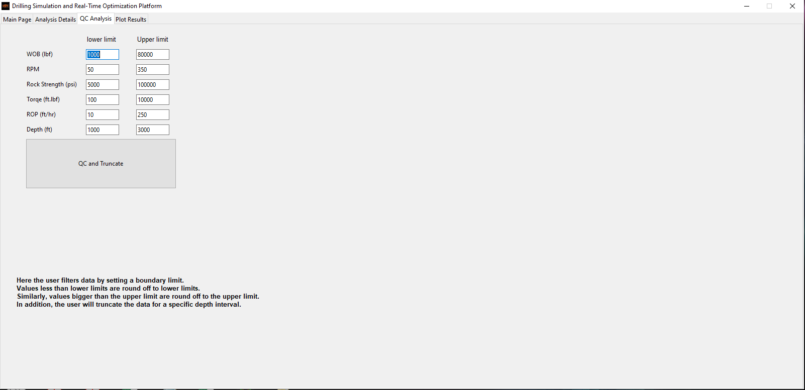
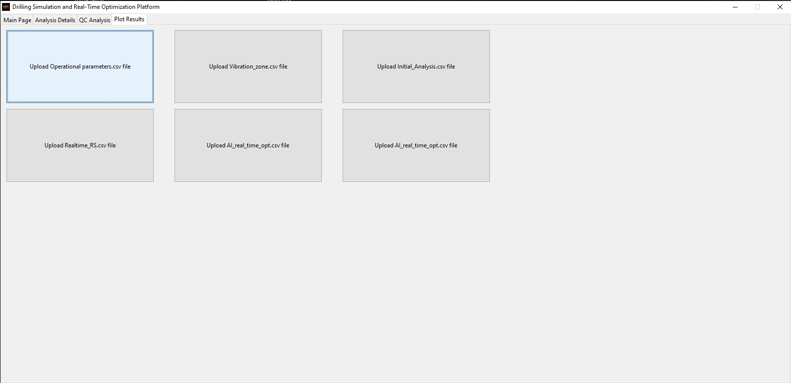
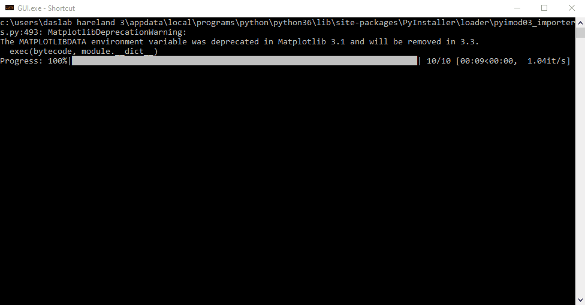
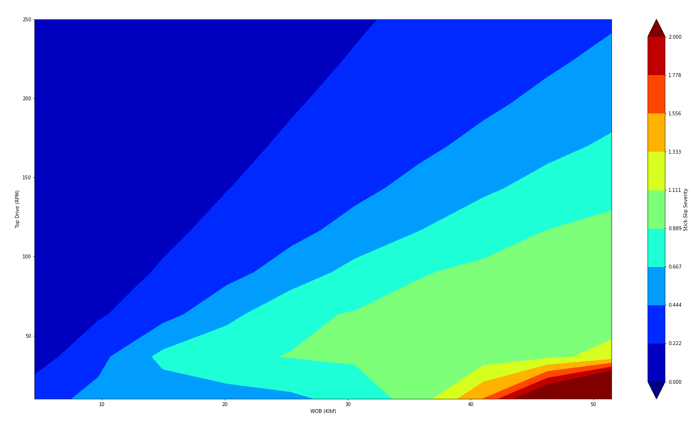
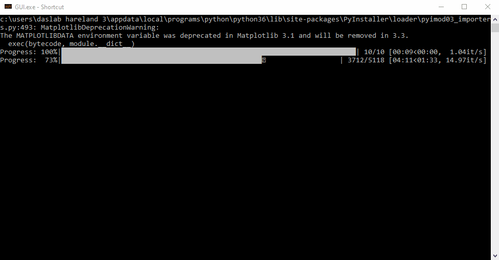

<p align="center">
  
</p>


# Energy Department Announces $11.4 Million for New Projects to Advance Efficient Drilling for Geothermal Energy


[WASHINGTON, D.C. ](https://www.energy.gov/articles/energy-department-announces-114-million-new-projects-advance-efficient-drilling-geothermal)– Today, the U.S. Department of Energy (DOE) announced the selection of seven projects totaling nearly $11.4 million to advance geothermal energy development. The projects will focus on accelerating the research and development (R&D) of innovative geothermal energy technologies in America. 

“Geothermal energy is a clean and efficient base-load energy resource, making it an important part of our nation’s diverse energy portfolio,” U.S. Secretary of Energy Rick Perry said. “Developing new, efficient drilling technologies will reduce these costs and increase the availability of this domestic renewable energy resource.” 

Currently, American geothermal electricity production is located solely in the western states, where conventional geothermal resources put about 3.8 gigawatts (GW) of electricity on the grid. It has the potential to expand through hydrothermal and enhanced geothermal systems, which could tap into an estimated 100 GW of currently inaccessible resources and remove the geographic barriers of conventional geothermal resources.

Technological innovation is necessary to economically convert these resources into cost-effective energy resources. The awardees will focus on early-stage R&D projects exploring innovative technologies for drilling geothermal wells that show the ability to reduce non-drilling time, improve rates of penetration, and identify methods to accelerate the transfer of geothermal drilling and related technologies from the laboratory to the marketplace. 

### The selected projects include: 

**Argonne National Laboratory (Argonne, IL):** Developing more advanced, low-cost materials using superhard nano-composites combined with ultrafast surface treatment to create new drill bits with tunable properties capable of doubling rates of penetration (ROP) for drilling geothermal wells.
General Electric Company, GE Global Research (Niskayuna, NY): Developing and testing a new directional drilling orientation sensor capable of operating at 300°C for 1000 hours; this will enable measurement-while-drilling (MWD) at the significantly higher temperatures needed for geothermal drilling than current tools.

**Oklahoma State University (Stillwater, OK):** Developing a new detailed model for common drill bits (PDC) based on tracking cutter wear from rock/bit interactions and then design a system to optimize geothermal drilling based on real-time data from that model. 

**Sandia National Laboratories (Albuquerque, NM):** Developing sensing tools, algorithms, and actuators for an intelligent drilling architecture which optimizes how deep the drill cutter goes in real-time, leading to longer life for down-hole drilling components, reduced unplanned trips, and more consistent drilling rates.

**Sandia National Laboratories (Albuquerque, NM):** Developing and testing a new all-metal down-hole motor that turns drilling fluid flow into torque; this motor will remove current temperature limitations, reduce vibrations, and enable directional drilling into high-temperature geothermal reservoirs.

**Texas A&M Engineering Experiment Station (College Station, TX):** Developing and testing a new drill bit system that uses nanosecond micro-plasma discharge to create localized shock waves which initiate micro-cracks ahead of the bit, making it easier to cut rock; this system is capable of doubling ROP for drilling in geothermal wells.

**University of Oklahoma (Norman, OK):** Developing and testing smart lost circulation materials (LCM) that use shape memory polymers activated by geothermal temperature to prevent the loss of fluid into fractured rock next to the drilled wellbore; the smart LCM expands within the fractures to reduce non-drilling time (NDT) and strengthen the wellbore in high temperature geothermal drilling operations.
DOE’s Geothermal Technologies Office supports early-stage R&D to achieve necessary technological breakthroughs. Learn more about DOE’s Geothermal Technologies Office HERE.


<!--
### The GUI tabs are seen in the following images.

<p align="left">
  
  
  
  
</p>
-->


**Driling Realtime Optimziation Software**. 
This is part of a DOE project at Oklahoma State University. 

Team members:
```
Dr. Geir Hareland
Dr. Runar Nygaard
Dr. Saman Akhtarmanesh
Dr. Mohammed F. Al Dushaishi
Dr. Amin Atashnezhad
```


The project incorporates several modules to achieve a Real-time drilling optimization system with emphasis on geothermal drilling (Utah-Forge).

The PDC ROP modeling: A model was developed for hard-rocks considering the PDC bit details including number of cutters, number of blades, cutter back rake, cutter side rake, cutter diameter, RPM, WOB, bit diameter, and apparent rock strength.

Two concepts, including threshold weight on cutter (WOC_t) and threshold rate of penetration (ROP_t) introduced and used for de the two main regions in drilling ROP-WOB plots. 

The drill string vibration model developed (Al Dushaishi et al. 2019) was used for vibration simulation and to detect the critical regions. The critical regions are considered and are avoided for operational parameter design purposes. 

Glowka (1978) developed an analytical PDC cutter temperature model. The Glowka model was used for tracking the cutter temperature in real-time considering several parameters including bit grade.

A Real-time bit wear model was developed to track the bit grade in real-time. This is essential due to the fact the cutters are progressively worn out which will affect the drilling performance, depth of cut, rate of penetration, cutter temperature, etc.


**The Realtime Drilling Optimization Platform has five tabs including**:
* Main Page
* Analysis Details
* QC Analysis
* Plot Results
* Streaming


The system at this stage simulates the ROP, taking the essential parameters as a .csv file including depth, dt, WOB, RPM, ROP_data, and rock strength. 
In step two, the software back calculates the rock strength in real-time, using the ROP model and ROP_data and bit details. The ROP_data is used in the ROP model and the one unknown parameter (ARS) is back-calculated. The ARS then is turned into the CCS and UCS considering the depth and MW into account.

In step three, the user can run the software to calculate the best WOB and RPM for the current foot of drilling and assuming that the rock strength is the same for the next foot. Knowing the rock strength, a foot ahead, the searching algorithm (differential evolution algorithm) will find the best WOB and RPM to maximize the objective function (defined by the user, i.e. MSE, ROP, or combination of MSE and ROP) while avoiding the critical vibrational and cutter temperature defined by the user.

The user also can-do separate drill string vibration analyses on different rock strengths.

The Software output for vibration analysis is seen below.

<p align="left">
  
   
</p>


The software will plot and compares the simulation results in 5 separate stages. 
The user can save the analysis design in CSV format along with the simulation outputs from three steps.
The software can read the WITSML file and generates its necessary input file to be used in simulation and optimization procedures.


**A simulation of ROP, Temperature and MSE for different BG values at constant rock strength is seen at the following.**

<p align="left">
  
</p>


<!--
# Graphical User interface (GUI) for Realtime Drilling Optimization system

<p align="left">
  
</p>
-->


<!--
### Tree structure of Realtime Drilling Optimization Platform is provided at the following.

```bash
Folder PATH listing for volume OS
Volume serial number is 5448-9438
C:.
|   Function_set.py
|   GUI.ipynb
|   GUI_cleaned_underProgress.ipynb
|   GUI_Functions.py
|   OkstateLogo.ico
|   Part_01.py
|   Part_02.py
|   Part_03.py
|   Plotting.ipynb
|   Plot_function_1.py
|   Plot_function_2.py
|   Plot_function_3.py
|   Plot_function_4.py
|   Plot_function_5.py
|   Plot_function_6.py
|   Plot_function_Vibration.py
|   progress_bar.ipynb
|   QC_function.py
|   README.md
|   Tab_2_Bit_Details.ipynb
|   Tab_2_Bit_Details.py
|   Tab_2_Optimization_Properties.ipynb
|   Tab_2_Optimization_Properties.py
|   Tab_2_PDC_Mud_Heat_Properties_Mud_details.ipynb
|   Tab_2_PDC_Mud_Heat_Properties_Mud_details.py
|   tree.txt
|   Vibration_Analysis.ipynb
|   Vibration_Analysis.py       
+---Assets
|       Capture.PNG
|       Capture2.PNG
|       
+---DataSet
|   +---Bit13_Utah_Forge_well_58_32 upper interval
|   |       AI_real_time_opt.csv
|   |       Data_Bit_details.csv
|   |       Data_for_bit_temp.csv
|   |       Data_Operational_Parameters.csv
|   |       Initial_analysis.csv
|   |       Realtime_RS.csv
|   |       
|   +---Bit13_Utah_Forge_well_58_32_lower interval
|   |       AI_real_time_opt.csv
|   |       Data_Bit_details.csv
|   |       Data_for_bit_temp.csv
|   |       Data_Operational_Parameters.csv
|   |       Initial_analysis.csv
|   |       Realtime_RS.csv
|   |       
|   +---Bit1_Chocolate_Mountain_pyspark_cleaned
|   |       Analysis_Details.csv
|   |       Data_Bit_details.csv
|   |       Data_for_bit_temp.csv
|   |       Data_Operational_Parameters.csv
|   |       Initial_analysis.csv
|   |       Realtime_RS.csv
|   |       
|   \---Bit2_Chocolate_Mountain_pyspark_cleaned
|           Data_Bit_details.csv
|           Data_for_bit_temp.csv
|           Data_Operational_Parameters.csv
|           Initial_analysis.csv
|           QC_Data.csv
|           Realtime_RS.csv
|           
+---Figures
|       plot_1.png
|       plot_2.png
|       plot_3.png
|       plot_4.png
|       
+---Images
|       academic-seal.ico
|       academic-seal.jpg
|       Capture.PNG
|       data-analysis-blog.png
|       hnet.com-image (1).ico
|       hnet.com-image.ico
|       OkstateLogo (1).ico
|       OkstateLogo.ico
|       OkstateLogo.png
|       SPE.png
|       
+---Modules
|   |   Bit_Grade.py
|   |   Bit_Grade_With_start.py
|   |   Cutter_Face_Contact_Area.py
|   |   Cutter_Froce.py
|   |   Cutter_Temprature.py
|   |   Cutter_Wear_Flat_Area.py
|   |   Cutter_Work.py
|   |   DE_Algorithm_01.py
|   |   DE_Algorithm_02.py
|   |   DOC_calculation.py
|   |   Drilling_Time_calc.py
|   |   General_Functions.py
|   |   generate_candidate.py
|   |   MSE.py
|   |   Parameters_seperation_functions.py
|   |   Plot_1.py
|   |   Plot_2.py
|   |   Plot_3.py
|   |   Plot_4.py
|   |   ROP_models.py
|   |   Some_necessary_constants.py
|   |   Temprature_models.py
|   |   Time_converter.py
|   |   Wf.py
```

-->


