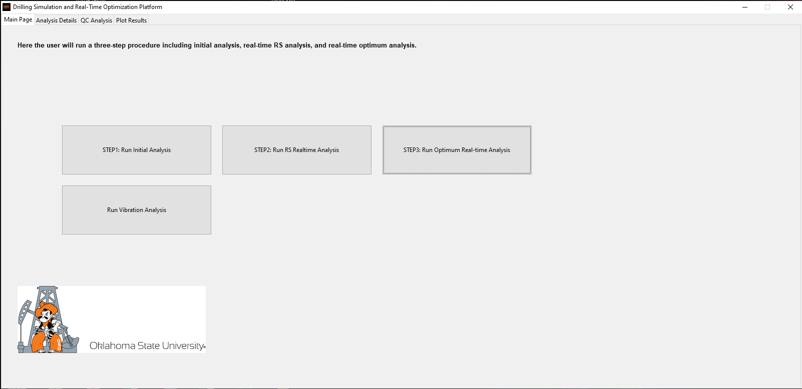
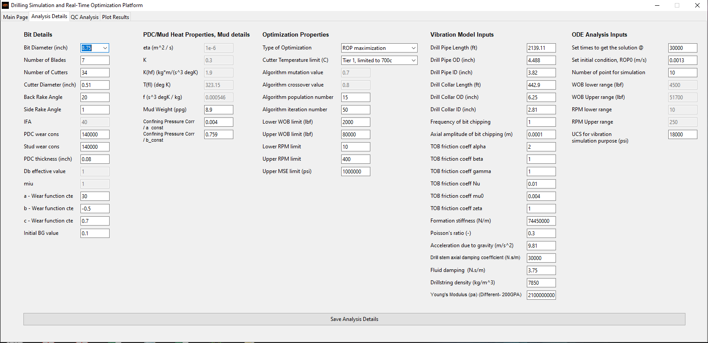

# GUI

Driling Realtime Optimziation (powered by AI) Software developed by Amin Atashnezhad. This is part of a DOE project at Oklahoma State University. 

Team memberes:

Dr Geir Hareland

Dr Runar Nygaard

Dr Saman Akhtarmanesh

Dr Mohammed F. Al Dushaishi

Dr Amin Atashnezhad

The Graphical User interface are seen at the following images.
Also an example of software output are provided.

  

  

A GUI for drilling platform powered by AI
